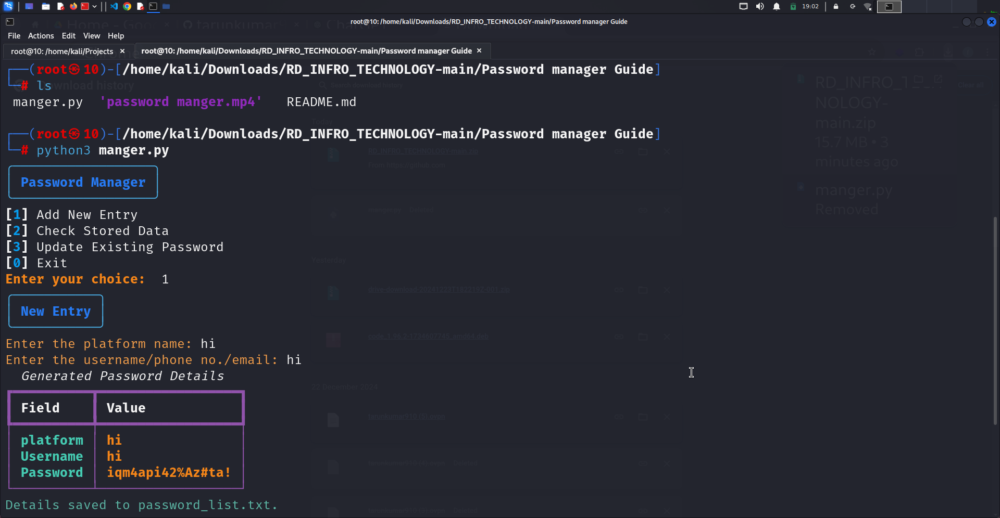

<div align="center">
    <h1 style="font-weight: bold; color: blue;">Password Manager</h1>
</div>

<p align="center">
  <a href="#introduction">Introduction</a> •
  <a href="#features">Features</a> •
  <a href="#installation">Install</a> •
  <a href="#usage">Usage</a> •
  <a href="#work">Work</a> •
  <a href="#future">Future</a> •
  <a href="#conclusion">Conclusion</a>
</p>

---

## Introduction

The **Password Manager** is a Python-based tool designed to securely generate, store, and retrieve passwords for various platforms. This tool features a visually appealing console interface using the `rich` library and provides essential functionalities for managing your credentials.

This project demonstrates the use of:

- **Rich Library:** Provides visually appealing tables and panels for output.
- **File Handling:** Efficiently manages password storage and updates in a text file.
- **Interactive Console:** Features an easy-to-navigate menu for user interaction.
- **Error Handling:** Implements robust exception handling to manage missing files or invalid inputs.
- **Custom Password Generation:** Creates strong, randomized passwords to enhance security.

---

## Features

<h1 align="center">
  </a>
  <br>
</h1>

- **Strong Password Generator**: Generates secure passwords with a customizable length.
- **Save and Update Credentials**: Easily store, update, and manage passwords in a text file.
- **Search Functionality**: Retrieve credentials for specific platforms quickly.
- **User-Friendly Menu**: Navigate all features through a simple, interactive menu interface.
- **Formatted Output**: Uses the `rich` library to display tables and panels for better readability.
- **Exception Handling**:Gracefully handles errors such as missing files or invalid inputs.

---

## Usage

1. **Launch the Password Manager**:
   - Run the Python script in your terminal.
   
2. **Choose an Option**:
   - **Add New Entry**: Generate and store a password for a platform.
   - **Check Stored Data**: Search for saved credentials by platform name.
   - **Update Existing Password**: Generate and update a password for an existing platform and username.
   - **Exit**: Quit the application.

3. **Details**:
   - Passwords are saved in a text file (*password_list.txt*).
   - Each entry includes the platform name, username, and password.

---

## Installation

### Prerequisites
To run this project, you need:

- Python 3.8 or higher.
- Required Python libraries:
  - `rich`
    

### Steps to Install
```bash
# Clone the repository
https://github.com/tarunkumar910/RD_INFRO_TECHNOLOGY.git

# Navigate to the folder
cd cd RD_INFRO_TECHNOLOGY-main/
cd Password\ manager\ Guide

# Install dependencies
pip install cryptography

